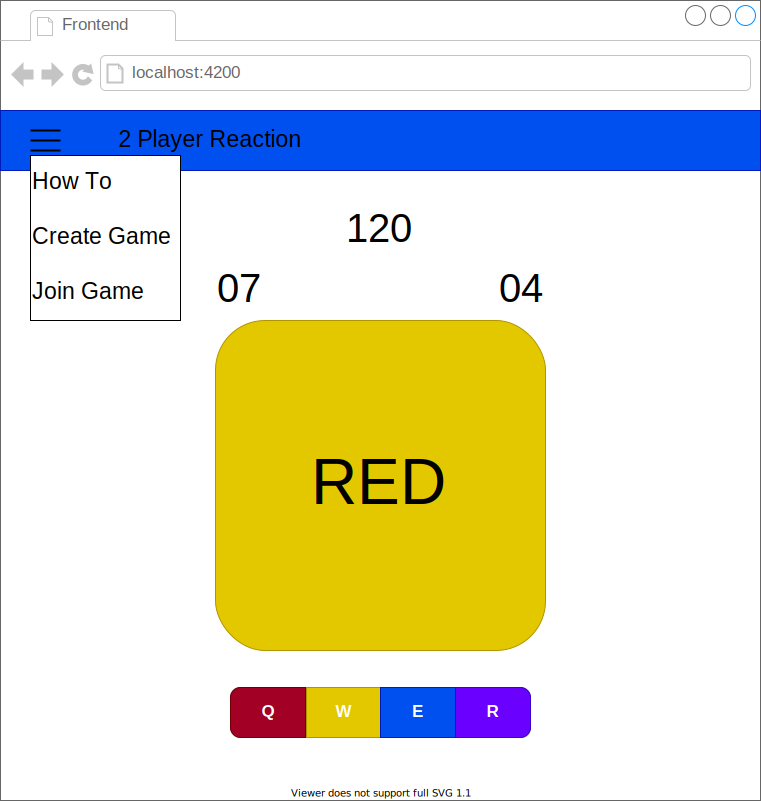
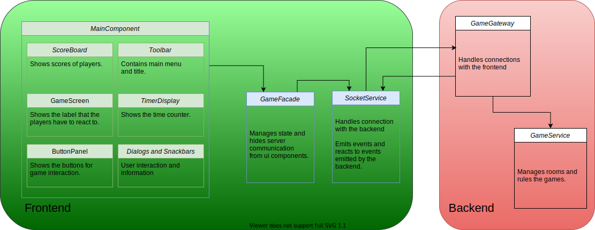

# Creating a Multiplayer Game with Angular and Nestjs

- [Creating a Multiplayer Game with Angular and Nestjs](#creating-a-multiplayer-game-with-angular-and-nestjs)
  - [Introduction](#introduction)
    - [Tech Stack](#tech-stack)
    - [What This Is Not](#what-this-is-not)
    - [From the Idea to the Mockup to the Architecture](#from-the-idea-to-the-mockup-to-the-architecture)
    - [Set up Development Environment](#set-up-development-environment)
  - [Implementation](#implementation)
    - [Creating Games](#creating-games)
    - [Joining Games](#joining-games)
    - [Interacting with the Client](#interacting-with-the-client)
      - [Angular Material](#angular-material)
      - [Toolbar](#toolbar)
      - [Dialogs](#dialogs)
      - [Snack Bars](#snack-bars)
    - [Game Facade](#game-facade)
    - [Game Logic](#game-logic)
      - [Starting Games](#starting-games)
      - [Player Moves](#player-moves)
    - [Game UI](#game-ui)
      - [Score Board](#score-board)
      - [Game Screen](#game-screen)
      - [Button Panel](#button-panel)
      - [Update Main Component](#update-main-component)
    - [Wireing the UI to the Logic](#wireing-the-ui-to-the-logic)
    - [Win Condition](#win-condition)
    - [Preparation for Deployment](#preparation-for-deployment)
  - [Conclusion](#conclusion)
    - [Next Steps](#next-steps)
  - [Article TODOs](#article-todos)

## Introduction

In this article you will see how to create a simple multiplayer game using Angular as the frontend technology and Nestjs for the backend. Everything will be wrapped into one single mono repository using NxDev, a cli that leverages the Angular cli. Socketio will help coping with the challenges that a real-time multiplayer game poses. Angular Material will save time on the frontend design.

You find all the code that is discussed in this artikel [here on github](https://github.com/SoftwareKater/nx-multiplayer-game). Also, the app is [deployed to heroku](https://nx-confusion-staging.herokuapp.com/). Pay a visit to see what we are up to.
### Tech Stack

Nrwl Nx Workspace
Angular 10
Angular Material
NestJs
Socket.io

### What This Is Not

There will be no databases involved, so no persistence of any kinds of information. There is no authentication or authorization and generally no treatment of security issues. We will also exclude continuous integration, version control systems and testing. Those things should all be part of the development process of any app, but would go beyond the scope of this article.

### From the Idea to the Mockup to the Architecture

The game is a simple 2 player reaction game that is all about eye-hand coordination. It works as follows. Each player has four buttons - blue, yellow, purple, and red. A big label in the middle of the screen displays the name of one of these colors. The background color of this label is randomly chosen among the other colors. The players have to press the button matching the word (not the background color). Hitting the right button earns one point. Wrong clicks loose 2 points. The first one to receive a total of 10 points wins.





### Set up Development Environment

For the next section you need to have a nx workspace with the angular and nestjs plugins up and running. If you know how to do this, you may well skip this section an move on to the next section. Just make sure that you have an nx workspace with a nestjs app and an angular app set up before you start the next section. Stay here if you want to learn how to bootstrap a mono repository with NxDev.

Install node and verify the installation:

```shell
λ npm --version
6.14.8

λ node --version
v14.15.0
```

Install Angular and NxDev

```shell
λ npm i -g @angular/cli@10.0.0

λ npm i -g nx
```

Create a new nx workspace

```shell
λ npx create-nx-workspace@latest
npx: Installierte 182 in 16.475s
? Workspace name (e.g., org name)     nx-confusion
? What to create in the new workspace empty             [an empty workspace with a layout that works best for building apps]
? CLI to power the Nx workspace       Nx           [Recommended for all applications (React, Node, etc..)]
? Use Nx Cloud? (It's free and doesn't require registration.) No
```

Install angular and nestjs plugins

```shell
λ npm i -D @nrwl/angular
λ npm i -D @nrwl/nest
```

Create the backend app

```shell
λ nx g @nrwl/nest:app backend
```

Create the frontend app

```
λ nx g @nrwl/angular:app
? What name would you like to use for the application? frontend
? Which stylesheet format would you like to use? SASS(.scss)  [ http://sass-lang.com   ]
? Would you like to configure routing for this application? No
```

## Implementation

As a first step we will construct a simple backend that provides handlers for clients to connect and send messages. And a simple frontend that connects to the backend and sends some test messages.

### Creating Games

Let's install some packages that we will need along the way.

```shell
λ npm i --save @nestjs/websockets @nestjs/platform-socket.io
λ npm i --save-dev @types/socket.io
λ npm install uuid
```

Lay the foundation of our game module, where we handle everything related to the game.

```shell
λ nx g @nrwl/nest:module -p backend --directory app game
λ nx g @nrwl/nest:gateway -p backend --directory app game
λ nx g @nrwl/nest:service -p backend --directory app game
```

The gateway will serve as the entrance to our backend. Clients that connect or send messages to the backend will be served by the gateway.

```typescript
apps/backend/app/game/game.gateway.ts

import {
  ConnectedSocket,
  SubscribeMessage,
  WebSocketGateway,
  WsResponse,
} from '@nestjs/websockets';
import { Socket } from 'socket.io';
import { CreateGameResponse } from 'tools/schematics';
import { GameService } from './game.service';

@WebSocketGateway()
export class GameGateway {
  constructor(private readonly gameService: GameService) {}

  @SubscribeMessage('create-game')
  async handleCreateGame(
    @ConnectedSocket() soc: Socket
  ): Promise<WsResponse<CreateGameResponse>> {
    try {
      const result = await this.gameService.createGame(soc);
      return { event: 'game-created', data: result };
    } catch (err) {
      console.error(err);
      return { event: 'error-creating', data: err.message };
    }
  }
}
```

For the tough work, the gateway will employ the game service.

```typescript
apps/backend/app/game/game.service.ts

import { Injectable } from '@nestjs/common';
import { Socket } from 'socket.io';
import { CreateGameResponse } from 'tools/schematics';
import { v4 as uuid } from 'uuid';

@Injectable()
export class GameService {
  public async createGame(socket: Socket): Promise<CreateGameResponse> {
    const roomId = uuid();
    const player1Id = socket.id;
    return new Promise((resolve, reject) => {
      socket.join(roomId, (err) => {
        if (err) {
          reject(err);
        } else {
          console.log(
            `Successfully created new room ${roomId} and connected player1 ${player1Id}`
          );
          resolve({ roomId, player1Id });
        }
      });
    });
  }
}
```

As you can see from the line `import { CreateGameResponse } from 'tools/schematics';` we keep the types at the common place `tools/schematics`. That folder was created when we first bootstrapped the NxDev mono repo.

```typescript
tools/schematics/create-game-response.interface.ts

export interface CreateGameResponse {
  roomId?: string;
  player1Id?: string;
}
```

```typescript
tools/schematics/index.ts

export * from './create-game-response.interface';
```

Lets turn to the frontend. Create a socket service that handles the connection and communication with the backend.

```shell
λ npm install --save @types/socket.io-client
```

```typescript
apps/frontend/src/app/socket.service.ts

import { Injectable } from '@angular/core';
import * as io from 'socket.io-client';

const SOCKET_ENDPOINT = 'http://localhost:3333';

@Injectable({ providedIn: 'root' })
export class SocketService {
  private connection: SocketIOClient.Socket;

  public connect() {
    this.connection  = io(SOCKET_ENDPOINT, {});
  }

  public createGame() {
    this.connection.emit('create-game');
  }
}
```

Inject the socket service into the app component, by adding it to the constructor parameters. Angulars dependency injeciton system will take care of providing the singleton instance of the socket service to the app component.

```typescript
apps/frontend/src/app/app.component.ts

import { Component, OnInit } from '@angular/core';
import { SocketService } from './socket.service';

@Component({
  selector: 'nx-confusion-root',
  templateUrl: './app.component.html',
  styleUrls: ['./app.component.scss'],
})
export class AppComponent implements OnInit {
  title = 'frontend';

  constructor(private readonly socketService: SocketService) {}

  ngOnInit() {
    this.socketService.connect();
    this.socketService.createGame();
  }
}
```

Before we serve the apps, lets fix a warning that would otherwise pop up in our frontend. Go to `workspace.json` and add `socket.io-client` to the allowed common js dependencies (https://angular.io/guide/build#configuring-commonjs-dependencies).

```json
    ...
  },
  "frontend": {
    "projectType": "application",
    "schematics": {
      "@schematics/angular:component": {
        "style": "scss"
      }
    },
    "root": "apps/frontend",
    "sourceRoot": "apps/frontend/src",
    "prefix": "nx-confusion",
    "architect": {
      "build": {
        "builder": "@angular-devkit/build-angular:browser",
        "options": {
          "allowedCommonJsDependencies": [
            "socket.io-client"
          ],
          ...
        }
```


Now serve both the frontend and the backend. To do that open two console windows and issue

```
λ nx serve frontend
λ nx serve backend
```

While keeping an eye on the console window where you started the backend, open your browser at `http://localhost:4200`. Upon rendering the default NxDev welcome page (that we will soon erase), the backend console should log something like

```shell
Successfully created new room efa8fb98-6d2e-41d0-aadc-f99adac6563c and connected player1 366q_Ql0gJhMJ3AsAAAB
```

Great! We conneted a frontend dummy to a backend dummy and they already started to communicate. Lets dive deeper!

### Joining Games

This time we will start with the data structures. Joining a game requires a room number. So a request to join a game must provide that.

```typescript
tools/schemas/join-game-request.interface.ts

export interface JoinGameRequest {
  roomId: string;
}
```

If a client joins a room he needs to now which name he goes by in that room. Also he might want to know what his opponent is called.

```typescript
tools/schemas/join-game-response.interface.ts

export interface JoinGameResponse {
  roomId?: string;
  player1Id?: string;
  player2Id?: string;
}
```

We will build an in-memory storage to keep track of all games that we have created. This will also be the place to save the data that is manipulated by our backend (we do not want to handle scores in the client).

```typescript
tools/schemas/game-data.interface.ts

export interface GameData {
  roomId?: string;
  player1Id?: string;
  player1Score?: number;
  player2Id?: string;
  player2Score?: number;
}
```

Don't forget to add the new interfaces to the index file. Otherwise our editor/ide will not be able to find them or suggest them for auto-importing.

```typescript
tools/schemas/index.ts

export * from './create-game-response.interface';
export * from './game-data.interface';
export * from './join-game-request.interface';
export * from './join-game-response.interface';
```

In the gateway, add a new handler.

```typescript
apps/backend/app/game/game.gateway.ts

import {
  ConnectedSocket,
  MessageBody,
  SubscribeMessage,
  WebSocketGateway,
  WsResponse,
} from '@nestjs/websockets';
import { Socket } from 'socket.io';
import {
  CreateGameResponse,
  JoinGameRequest,
  JoinGameResponse,
} from 'tools/schematics';
import { GameService } from './game.service';

@WebSocketGateway()
export class GameGateway {
  constructor(private readonly gameService: GameService) {}

  @SubscribeMessage('create-game')
  async handleCreateGame(
    @ConnectedSocket() soc: Socket
  ): Promise<WsResponse<CreateGameResponse>> {
    try {
      const result = await this.gameService.createGame(soc);
      return { event: 'game-created', data: result };
    } catch (err) {
      console.error(err);
      return { event: 'error-creating', data: err.message };
    }
  }

  @SubscribeMessage('join-game')
  async handleJoinGame(
    @MessageBody() req: JoinGameRequest,
    @ConnectedSocket() soc: Socket
  ): Promise<WsResponse<JoinGameResponse>> {
    try {
      const result = await this.gameService.joinGame(req, soc);
      soc.broadcast.to(result.roomId).emit('player-joined', result);
      return { event: 'game-joined', data: result };
    } catch (err) {
      console.error(err);
      return { event: 'error-joining', data: err.message };
    }
  }
}
```

Again the Add the in-memory storage to the game service.

```typescript
apps/backend/app/game/game.service.ts

import { Injectable } from '@nestjs/common';
import { Socket } from 'socket.io';
import {
  CreateGameResponse,
  GameData,
  JoinGameRequest,
  JoinGameResponse,
} from 'tools/schematics';
import { v4 as uuid } from 'uuid';

@Injectable()
export class GameService {
  public inMemoryStorage: GameData[] = [];

  public async createGame(socket: Socket): Promise<CreateGameResponse> {
    const roomId = uuid();
    const player1Id = socket.id;
    return new Promise((resolve, reject) => {
      socket.join(roomId, (err) => {
        if (err) {
          reject(err);
        } else {
          console.log(
            `Successfully created new room ${roomId} and connected player1 ${player1Id}`
          );
          this.inMemoryStorage.push({ roomId, player1Id });   // added
          resolve({ roomId, player1Id });
        }
      });
    });
  }

  public async joinGame(
    request: JoinGameRequest,
    socket: Socket
  ): Promise<JoinGameResponse> {
    const roomId = request.roomId;
    const player2Id = socket.id;
    const gameIdx = this.inMemoryStorage.find(game => game.roomId === roomId);
    if (gameIdx <= 0) {
      throw new Error('RoomNotFound');
    }
    const player1Id = this.inMemoryStorage[gameIdx].player1Id;
    return new Promise((resolve, reject) => {
      socket.join(roomId, (err) => {
        if (err) {
          reject(err);
        } else {
          console.log(
            `Successfully connected player2 ${player2Id} to existing room ${roomId}`
          );
          this.inMemoryStorage[gameIdx].player2Id = player2Id;
          resolve({
            roomId,
            player1Id,
            player2Id,
          });
        }
      });
    });
  }
}
```

Lets try out our new joining functionality, by creating the counterparts in our client. Add event handlers to the socket connection using `this.connection.on(event: string, (res: any) => void)`. Add a `joinGame` method that emits the `join-game` event and sends the required message body.

```typescript
apps/frontend/src/app/socket.service.ts

import { Injectable } from '@angular/core';
import * as io from 'socket.io-client';
import { CreateGameResponse, JoinGameRequest, JoinGameResponse } from 'tools/schematics';

const SOCKET_ENDPOINT = 'http://localhost:3333';

@Injectable({ providedIn: 'root' })
export class SocketService {
  private connection: SocketIOClient.Socket;

  public connect(): void {
    this.connection = io(SOCKET_ENDPOINT, {});
    this.connection.on('game-created', (res: CreateGameResponse) => {
      console.log('ACK game-created ', res);
    });
    this.connection.on('error-creating', (errMsg: string) => {
      console.error('Error while creating a game: ', errMsg)
    })
    this.connection.on('game-joined', (res: JoinGameResponse) => {
      console.log('ACK game-joined ', res);
    })
    this.connection.on('error-joining', (errMsg: string) => {
      console.log('Error while joining a game: ', errMsg);
    })

  }

  public createGame(): void {
    this.connection.emit('create-game');
  }

  public joinGame(roomId: string): void {
    const req: JoinGameRequest = { roomId };
    this.connection.emit('join-game', req);
  }
}
```

In the OnInit life-cycle method of our app component, add a call to the new `joinGame` method.

```typescript
apps/frontend/src/app/app.component.ts

ngOnInit() {
  this.socketService.connect();
  this.socketService.createGame();
  this.socketService.joinGame('hallo');
}
```

Goto the browser tab, where the app is running and open the developer tools. If you refresh you browser you will see one acknowledgement message and one error. The game creation succeeded, and in the corresponding ACK we can find the roomId and the id of player 1. Since we created the game, we are automatically assigned as player 1. Joining the game however failed, because we tried to join a game that takes place in a room with id `hello`. But there is no room with that id, therefore joining the game had all the rights to fail.

### Interacting with the Client

We have made a huge step. Our client-server (frontend-backend) communcation now works both ways. The client emits events, to trigger the server. The server reacts and in turn sends events back to the client. The client again consumes the returned events and prints them to console. However, this is all static and we as a user cannot interact in the client-server communication. So before turning to the game logic, lets put a little work into the user interface. In this section we will create the overall layout and menu items.

#### Angular Material

```shell
λ npm i @angular/material @angular/cdk
```

Add one of the prebuilt themes to styles array in `workspace.json`. It is a sibling of the `allowedCommonJsDependencies` array.

```json

"styles": [
  "./node_modules/@angular/material/prebuilt-themes/indigo-pink.css",
  "apps/frontend/src/styles.scss"
],
```

Update the `index.html` with the material design icon font.

```html
<!DOCTYPE html>
<html lang="en">
  <head>
    <meta charset="utf-8" />
    <title>Frontend</title>
    <base href="/" />
    <meta name="viewport" content="width=device-width, initial-scale=1" />
    <link rel="icon" type="image/x-icon" href="favicon.ico" />
    <!-- Material Design Icon Fonts -->
    <link href="https://fonts.googleapis.com/css?family=Roboto:300,400,500&display=swap" rel="stylesheet">
    <link href="https://fonts.googleapis.com/icon?family=Material+Icons" rel="stylesheet">
  </head>
  <body class="mat-typography">
    <nx-confusion-root></nx-confusion-root>
  </body>
</html>
```

Delete the contents of `app.component.html` and `app.component.scss`. Update `styles.scss` with the following definitions.

```scss
html,
body {
  height: 100%;
}
body {
  margin: 0;
  font-family: Roboto, "Helvetica Neue", sans-serif;
  background-color: whitesmoke;
}
```

#### Toolbar

Now we are ready to start working on the user interface. Create a toolbar component in a new `components` folder. It will show the title of the app and a menu.

```html
frontend/src/app/components/toolbar/toolbar.component.html

<mat-toolbar color="primary">
  <button
    mat-icon-button
    [matMenuTriggerFor]="menu"
    aria-label="Example icon-button with a menu"
  >
    <mat-icon>more_vert</mat-icon>
  </button>
  <mat-menu #menu>
    <button mat-menu-item (click)="onHowTo()">
      <mat-icon>help</mat-icon>
      <span>How To</span>
    </button>
    <button mat-menu-item (click)="onCreateGame()">
      <mat-icon>stars</mat-icon>
      <span>Create Game</span>
    </button>
    <button mat-menu-item (click)="onJoinGame()">
      <mat-icon>play_circle_filled</mat-icon>
      <span>Join Game</span>
    </button>
  </mat-menu>
  <span>2 Player Reaction</span>
</mat-toolbar>
```

In the typscript file add click handlers.

```typescript
frontend/src/app/components/toolbar/toolbar.component.ts

import { Component } from '@angular/core';

@Component({
    selector: 'nx-confusion-toolbar',
    templateUrl: 'toolbar.component.html'
})

export class ToolbarComponent {
    public onCreateGame() {
        console.log('create game clicked');
    }

    public onHowTo() {
        console.log('how to clicked');
    }

    public onJoinGame() {
        console.log('join game clicked');
    }
}
```

Add the new component to `app.component.html`

```html
<nx-confusion-toolbar></nx-confusion-toolbar>
```

In order to make everything work, we have to import all the material stuff that we are using.

```typescript
import { BrowserAnimationsModule } from '@angular/platform-browser/animations';
import { BrowserModule } from '@angular/platform-browser';
import { NgModule } from '@angular/core';

import { MatButtonModule } from '@angular/material/button';
import { MatIconModule } from '@angular/material/icon';
import { MatMenuModule } from '@angular/material/menu';
import { MatToolbarModule } from '@angular/material/toolbar';

import { AppComponent } from './app.component';
import { ToolbarComponent } from './components/toolbar/toolbar.component';

const MATERIAL_IMPORTS = [
  MatButtonModule,
  MatMenuModule,
  MatIconModule,
  MatToolbarModule,
];

@NgModule({
  declarations: [AppComponent, ToolbarComponent],
  imports: [BrowserAnimationsModule, BrowserModule, ...MATERIAL_IMPORTS],
  providers: [],
  bootstrap: [AppComponent],
})
export class AppModule {}
```

At this point you can fire up the apps again and check out our new UI.

#### Dialogs

We will use modal dialogs to communicate with the user. All the entries in the menu will show a different dialog. The "how to"-dialog will show a small text about the game and on how to create and join games. The "create game"-dialog will eventually call the `createGame` method of our socket service. Likewise the "join game"-dialog will call the `joinGame` method. Moreover it will display an input field so that the user can enter the id of the room that he wants to join.

Create a new folder `components/dialogs` where we keep all the dialogs we are about to create. Inside that create a new folder `how-to` and add the following two files

```html
frontend/src/app/components/dialogs/how-to/how-to.dialog.component.html

<h1 mat-dialog-title>How To</h1>
<div mat-dialog-content>Describe the game. Describe the other menu items.</div>
<div mat-dialog-actions>
  <button mat-button mat-dialog-close>Close</button>
</div>
```

```typescript
frontend/src/app/components/dialogs/how-to/how-to.dialog.component.ts

import { Component } from '@angular/core';

@Component({
  selector: 'nx-confusion-how-to-dialog',
  templateUrl: 'how-to.dialog.component.html',
})
export class HowToDialogComponent {}
```

To wire the dialog and the how to menu item, import the `HowToDialogComponent` into the toolbar component and change the callback method.

```typescript
frontend/src/app/components/toolbar/toolbar.component.ts

public onHowTo() {
  this.dialog.open(HowToDialogComponent);
}
```

Here are the other two dialogs.

```html
frontend/src/app/components/dialogs/create-game/create-game.dialog.component.html

<h1 mat-dialog-title>Create Game</h1>
<div mat-dialog-content>
  If you create a new game, you will be provided a room id. Pass this room id to a friend you want to play with.
</div>
<div mat-dialog-actions>
  <button mat-button [mat-dialog-close]="false">Cancel</button>
  <button mat-button mat-raised-button [mat-dialog-close]="true">Create</button>
</div>
```

```typescript
frontend/src/app/components/dialogs/create-game/create-game.dialog.component.ts

import { Component } from '@angular/core';

@Component({
  selector: 'angular-multiplayer-reaction-create-game-dialog',
  templateUrl: 'create-game.dialog.component.html',
})
export class CreateGameDialogComponent {}
```

```html
frontend/src/app/components/dialogs/join-game/join-game.dialog.component.html

<h1 mat-dialog-title>Join Game</h1>
<div mat-dialog-content>
  <mat-form-field>
    <mat-label>Room ID</mat-label>
    <input matInput placeholder="605e0ee1-945e-42f4-9282-9c57ce2bb787" #roomId>
  </mat-form-field>
</div>
<div mat-dialog-actions>
  <button mat-button mat-dialog-close>Cancel</button>
  <button mat-button [mat-dialog-close]="roomId.value" cdkFocusInitial>Join</button>
</div>
```

```typescript
frontend/src/app/components/dialogs/join-game/join-game.dialog.component.ts

import { Component } from '@angular/core';

@Component({
  selector: 'angular-multiplayer-reaction-join-game-dialog',
  templateUrl: 'join-game.dialog.component.html',
})
export class JoinGameDialogComponent {}
```

Delete everything but the connect call from the app components OnInit method.

```typescript
apps/frontend/src/app/app.component.ts

ngOnInit() {
  this.socketService.connect();
}
```

To test our new UI, open two browser tabs at `http://localhost:4200`. In the first tab hit "Create Game" and copy the room id from the console. In the second tab hit "Join Game" and paste the room id. Congratulations! Two different clients just joined one game room. We are ready to set up the game! Before we proceed with that task, lets add a little more convenience. The user should not have to access the dev tools, to get its room ID.

#### Snack Bars

We will use snack bars to inform the user about the different steps of the process of creating and joining a game. First of all, after creating a new game, the user should be given the room ID and should be supplied with an easy method to copy this room ID. Moreover the joining user should receive a notification when she successfully connected to the game. The creator on the other hand should receive a notification if another user joins his game room.

The snack bar that notifies the joining player about a successful connection is an easy one. Just open a snackbar containing a success message during the callback on `game-joined` events.

```typescript
socket.service.ts

public connect(): void {
  // ...
  this.connection.on('game-joined', (res: JoinGameResponse) => {
    this.snackBar.open(`Joined player 1 ${res.player1Id}`, '', {
      duration: 2500,
    });
  });
  // ...
}
```

For the game created snackbar lets create a new folder `snackbars` next to `dialogs` and add a new component `game-created.snackbar.component` there.

```html
frontend/src/app/components/snackbars/game-created/game-created.snackbar.component.html

<span> Game created! Room id: {{ data.roomId }} </span>
<button mat-button (click)="copyRoomIdAndDismiss()"><mat-icon>content_copy</mat-icon></button>
```

```typescript
frontend/src/app/components/snackbars/game-created/game-created.snackbar.component.ts

import { Inject } from '@angular/core';
import { Component } from '@angular/core';
import { MAT_SNACK_BAR_DATA, MatSnackBar } from '@angular/material/snack-bar';

@Component({
  selector: 'nx-confusion-game-created-snackbar',
  templateUrl: 'game-created.snackbar.component.html',
})
export class GameCreatedSnackbarComponent {
  constructor(
    @Inject(MAT_SNACK_BAR_DATA) public data: any,
    private readonly snackBar: MatSnackBar
  ) {}

  public async copyRoomIdAndDismiss() {
    await navigator.clipboard.writeText(this.data.roomId);
    this.snackBar.open('Copied room ID to clipboard!', '', { duration: 1500 });
  }
}
```
Our solution to copy the room ID to the clipboard will only work in newer browsers. If you want to support a bigger range of browsers have a look at (this)[https://stackoverflow.com/questions/400212/how-do-i-copy-to-the-clipboard-in-javascript].

To wire the new snackbar to the `game-created` event, open it in the callback. Don't forget to declare the new snackbar component in our app module.

```typescript
socket.service.ts

public connect(): void {
  // ...
  this.connection.on('game-created', (res: CreateGameResponse) => {
    this.snackBar.openFromComponent(GameCreatedSnackbarComponent, {
      data: {
        roomId: res.roomId,
      },
    });
  });
  // ...
}

```

Last but not least we open a snackbar when a player joins. This will be a new event that we register in our connect method.

```typescript
socket.service.ts

public connect(): void {
  // ...
  this.connection.on('player-joined', (res: JoinGameResponse) => {
    this.snackBar.open(`Player 2 ${res.player2Id} joined your game.`, '', {
      duration: 2500,
    });
  });
  // ...
}

```

The `player-joined` event should be emitted together with the `game-joined` event and it should only be received by player 1 (the creator) and not by player 2 (the joiner). This works like so.


```typescript
game.gateway.ts

@SubscribeMessage('join-game')
handleJoinGame(
  @MessageBody() req: JoinGameRequest,
  @ConnectedSocket() soc: Socket
): WsResponse<JoinGameResponse> {
  try {
    const result = this.gameService.joinGame(req, soc);
    soc.to(result.roomId).emit('player-joined', result);  // added
    return { event: 'game-joined', data: result };
  } catch (err) {
    console.error(err);
    return { event: 'error-joining', data: err.message };
  }
}
```

### Game Facade

We have set up the general layout to create a game inside it. Before we dive into game play, lets lay a foundation with a little refactoring. We already cramed our app module with all those material imports and dialog declarations. Lets keep the template, style sheet and typescript of our app component to a minimum. But we do need a container to orchestrate all our components. As shown in the architecture diagram, that purpose will be served by the main component.

```html
frontend/src/app/components/main/main.component.html

<div class="header">
  <nx-confusion-toolbar></nx-confusion-toolbar>
</div>

<div class="content">
</div>
```

```scss
frontend/src/app/components/main/main.component.scss

.header {
  margin-bottom: 16px;
}
```

Delete both app.component.html and app.component.scss. Change app.component.ts to

```typescript
app.component.ts

import { Component } from '@angular/core';

@Component({
  selector: 'nx-confusion-root',
  template: `
    <nx-confusion-main></nx-confusion-main>
  `,
})
export class AppComponent {}
```

You may have noticed that we broke our menu functions create and join game. That happend because we deleted the `ngOnInit` method in `app.component.ts`. That was the place where the initial socket connection was created. But don't worry we will fix this right now.

The architecture that we will now apply in the frontend is called "push-based". And at the heart of this architecture is a so called facade. As you can see from the architecture diagram, the facade is a layer between the components (UI) and the services (logic). So its most basic functionality is abstracting the service layer from the components, thus it will be easier for example to change (or exchange) the services.

Apart from this architectural feature, the facade manages the state of our frontend app. State is what makes frontend apps user-friendly and our app certainly can employ some form of state management. Moreover our components will not have to pull changes from the services manually or even ask services whether there are changes that should be reflected by re-rendering the UI. Instead the facade will push new changes into the components whenever the state of our app changes.

If you want to learn more about this great architecture head over to (this)[https://thomasburlesonia.medium.com/push-based-architectures-with-rxjs-81b327d7c32d] and (that)[https://thomasburlesonia.medium.com/ngrx-facades-better-state-management-82a04b9a1e39] article of Thomas Burleson.

Create a new file game.facade.ts with the following content.

frontend/src/app/game.facade.ts
```typescript

import { Injectable } from '@angular/core';
import { BehaviorSubject, Observable, combineLatest } from 'rxjs';
import {
  map,
  distinctUntilChanged,
  tap,
} from 'rxjs/operators';
import {
  Color,
  CreateGameResponse,
  GameData,
  GameScore,
  GameState,
  JoinGameResponse,
} from 'tools/schematics';

let STATE: GameState = {
  task: null,
  playerMove: null,
  score: null,
  loading: true,
};

@Injectable({ providedIn: 'root' })
export class GameFacade {
  private roomId: string;
  private playerId: string;
  private store = new BehaviorSubject<GameState>(STATE);
  private state$ = this.store.asObservable();

  task$ = this.state$.pipe(
    map((state) => state.task),
    distinctUntilChanged()
  );
  playerMove$ = this.state$.pipe(
    map((state) => state.playerMove),
    distinctUntilChanged()
  );
  score$ = this.state$.pipe(
    map((state) => state.score),
    distinctUntilChanged()
  );
  loading$ = this.state$.pipe(map((state) => state.loading));

  /**
   * Viewmodel that resolves once all the data is ready (or updated)...
   */
  public viewModel$: Observable<GameState> = combineLatest([
    this.task$,
    this.playerMove$,
    this.score$,
    this.loading$,
  ]).pipe(
    map(([task, playerMove, score, loading]) => {
      return { task, playerMove, score, loading };
    })
  );

  /**
   * Watch streams to trigger backend communication and state updates
   */
  constructor() {
    this.playerMove$
      .pipe(
        tap((playerMove: Color) => {
          if (playerMove) {
            console.log(playerMove);
          }
        })
      )
      .subscribe(() => {
        const playerMove = null;
        this.updateState({ ...STATE, playerMove, loading: false });
      });
  }

  public init() {
    this.socketService.connect();
    const score: GameScore = { player1: 0, player2: 0 };
    this.updateState({ ...STATE, score, loading: false });
  }

  // Allows quick snapshot access to data for ngOnInit() purposes
  public getStateSnapshot(): GameState {
    return { ...STATE, score: { ...STATE.score } };
  }

  public updatePlayerMove(playerMove: Color): void {
    this.updateState({ ...STATE, playerMove, loading: true });
  }

  /** Update internal state cache and emit from store... */
  private updateState(state: GameState) {
    this.store.next((STATE = state));
  }
}

}
```

As you can see in the `init` method, now the game facade is reponsible for creating the socket connection. The app component will in turn trigger the game facade.

frontend/src/app/main.component.ts
```typescript

import { Component, OnInit } from '@angular/core';
import { Observable } from 'rxjs';
import { Color, GameState } from 'tools/schematics';
import { GameFacade } from '../../services/game.facade';

@Component({
  selector: 'nx-confusion-main',
  templateUrl: 'main.component.html',
  styleUrls: ['main.component.scss'],
})
export class MainComponent implements OnInit {
  constructor(private readonly gameFacade: GameFacade) {}

  ngOnInit() {
    this.gameFacade.init();
  }
}
```

Add the method `createHandler` to the socket service. It allows to create event handlers from outside the socket service.

```typescript


public createHandler(event: string, callback: (res: any) => void): void {
  this.connection.on(event, callback);
}
```

Create a new function `createHandlers` in the game facade. Copy all lines but the first one from the `connect` method of the socket service to this new function. Adapt the code to its new location by exchanging `this.connection.on` with `this.socketService.createHandler`. Note that since we are suppling anonymous functions as callbacks, `this` will reference the game facade. If we were using methods of the game facade as callbacks, we would have to `.bind(this)`.

frontend/src/app/game.facade.ts
```typescript

constructor(private snackBar: MatSnackBar) {
  // ...
}

private createHandlers() {
  this.socketService.createHandler(
    'game-created',
    (res: CreateGameResponse) => {
      this.snackBar.openFromComponent(GameCreatedSnackbarComponent, {
        data: {
          roomId: res.roomId,
        },
      });
    }
  );
  this.socketService.createHandler('error-creating', (errMsg: string) => {
    console.error('Error while creating a game: ', errMsg);
  });
  this.socketService.createHandler('game-joined', (res: JoinGameResponse) => {
    this.snackBar.open(`Joined player 1 ${res.player1Id}`, '', {
      duration: 2500,
    });
  });
  this.socketService.createHandler(
    'player-joined',
    (res: JoinGameResponse) => {
      this.snackBar.open(`Player 2 ${res.player2Id} joined your game.`, '', {
        duration: 2500,
      });
    }
  );
  this.socketService.createHandler('error-joining', (errMsg: string) => {
    console.log('Error while joining a game: ', errMsg);
  });
}
```

At this point the point all functionalities of the frontend should work again.

### Game Logic

Since we will need it more often from now on, extract the code to retrieve a game from the in memory storage from the `joinGame` method.

```typescript
game.service.ts

private getGameIdxByRoomId(roomId: string): number {
  const gameIdx = this.inMemoryStorage.findIndex((g) => g.roomId === roomId);
  if (gameIdx <= 0) {
    throw new Error('RoomNotFound');
  }
  return gameIdx;
}
```

#### Starting Games

As soon as both players have joined the room, player 1 will emit the `start-game` event. The backend then has to check if everything is set up to start the game and if so create the first task.

```typescript
game.service.ts

public startGame(roomId: string): GameData {
  const game = this.inMemoryStorage[this.getGameIdxByRoomId(roomId)];
  const ready = !!game.player1Id && !!game.player2Id
  if (ready) {
    game.task = this.createTask();
    return game;
  } else {
    throw new Error('NotEnoughPlayers');
  }
}

private createTask(): GameTask {
  const colorCount = Object.keys(Color).length;
  return {
    label: Color[Math.random() * colorCount],
    background: Color[Math.random() * colorCount],
  };
}
```

We need a new endpoint in the gateway to trigger the new `startGame` method.

```typescript
game.gateway.ts

@SubscribeMessage('start-game')
handleStartGame(
  @MessageBody() req: StartGameRequest
): WsResponse<unknown> {
  try {
    const result = this.gameService.startGame(req.roomId);
    this.server.to(req.roomId).emit('new-task', result);
  } catch (err) {
    console.error(err);
    return { event: 'error-starting', data: err.message };
  }
}
```

#### Player Moves

After the game started, the players will make moves to score points. The game service needs to check whether a given player move is a match and award points to the player. Also if is a match, it must create a new task. The complete game service will look like that.

```typescript
game.service.ts

import { Injectable } from '@nestjs/common';
import { Socket } from 'socket.io';
import {
  Color,
  CreateGameResponse,
  GameData,
  GameTask,
  JoinGameRequest,
  JoinGameResponse,
} from 'tools/schematics';
import { v4 as uuid } from 'uuid';

@Injectable()
export class GameService {
  public inMemoryStorage: GameData[] = [];

  public createGame(socket: Socket): CreateGameResponse {
    const roomId = uuid();
    const player1Id = socket.id;
    socket.join(roomId, (err) => {
      if (err) {
        throw err;
      } else {
        console.log(
          `Successfully created new room ${roomId} and connected player1 ${player1Id}`
        );
      }
    });
    this.inMemoryStorage.push({ roomId, player1Id });
    return {
      roomId,
      player1Id,
    };
  }

  public joinGame(request: JoinGameRequest, socket: Socket): JoinGameResponse {
    const roomId = request.roomId;
    const player2Id = socket.id;
    const gameIdx = this.getGameIdxByRoomId(roomId);
    const player1Id = this.inMemoryStorage[gameIdx].player1Id;
    socket.join(roomId, (err) => {
      if (err) {
        throw err;
      } else {
        this.inMemoryStorage[gameIdx].player2Id = player2Id;
        console.log(
          `Successfully connected player2 ${player2Id} to existing room ${roomId}`
        );
      }
    });
    return {
      roomId,
      player1Id,
      player2Id,
    };
  }

  public startGame(roomId: string): GameData {
    const game = this.inMemoryStorage[this.getGameIdxByRoomId(roomId)];
    const ready = !!game.player1Id && !!game.player2Id
    if (ready) {
      game.task = this.createTask();
      return game;
    } else {
      throw new Error('NotEnoughPlayers');
    }
  }

  public playerMove(roomId: string, playerId: string, playerColor: Color): GameData {
    const game = this.inMemoryStorage[this.getGameIdxByRoomId(roomId)];
    game.match = false;
    if (this.checkMatch(game, playerColor)) {
      this.updateScore(game, playerId, 1);
      game.match = true;
      game.task = this.createTask();
    } else {
      this.updateScore(game, playerId, -2);
    }
    return game;
  }

  private checkMatch(game: GameData, playerColor: Color): boolean {
    if (game.task.label === playerColor) {
      return true;
    }
    return false;
  }

  private createTask(): GameTask {
    const colorCount = Object.keys(Color).length;
    return {
      label: Color[Math.random() * colorCount],
      background: Color[Math.random() * colorCount],
    };
  }

  private getGameIdxByRoomId(roomId: string): number {
    const gameIdx = this.inMemoryStorage.findIndex((g) => g.roomId === roomId);
    if (gameIdx <= 0) {
      throw new Error('RoomNotFound');
    }
    return gameIdx;
  }

  private updateScore(game: GameData, playerId: string, scoreDelta: number): void {
    if (game.player1Id === playerId) {
      game.player1Score += scoreDelta;
    } else {
      game.player2Score += scoreDelta;
    }
  }
}
```

After adding the corresponding gateway for the `player-move` event, the complete game gateway will look like this.

```typescript
game.gateway.ts

import {
  ConnectedSocket,
  MessageBody,
  SubscribeMessage,
  WebSocketGateway,
  WebSocketServer,
  WsResponse,
} from '@nestjs/websockets';
import { Socket, Server } from 'socket.io';
import {
  CreateGameResponse,
  JoinGameRequest,
  JoinGameResponse,
  PlayerMoveRequest,
  StartGameRequest,
} from 'tools/schematics';
import { GameService } from './game.service';

@WebSocketGateway()
export class GameGateway {
  @WebSocketServer()
  server: Server;

  constructor(private readonly gameService: GameService) {}

  @SubscribeMessage('create-game')
  handleCreateGame(
    @ConnectedSocket() soc: Socket
  ): WsResponse<CreateGameResponse> {
    try {
      const result = this.gameService.createGame(soc);
      return { event: 'game-created', data: result };
    } catch (err) {
      console.error(err);
      return { event: 'error-creating', data: err.message };
    }
  }

  @SubscribeMessage('join-game')
  handleJoinGame(
    @MessageBody() req: JoinGameRequest,
    @ConnectedSocket() soc: Socket
  ): WsResponse<JoinGameResponse> {
    try {
      const result = this.gameService.joinGame(req, soc);
      soc.broadcast.to(result.roomId).emit('player-joined', result);
      return { event: 'game-joined', data: result };
    } catch (err) {
      console.error(err);
      return { event: 'error-joining', data: err.message };
    }
  }

  @SubscribeMessage('start-game')
  handleStartGame(
    @MessageBody() req: StartGameRequest
  ): WsResponse<unknown> {
    try {
      const result = this.gameService.startGame(req.roomId);
      this.server.to(req.roomId).emit('new-task', result);
    } catch (err) {
      console.error(err);
      return { event: 'error-starting', data: err.message };
    }
  }

  @SubscribeMessage('player-move')
  handlePlayerMove(
    @MessageBody() req: PlayerMoveRequest,
  ): WsResponse<unknown> {
    try {
      const result = this.gameService.playerMove(
        req.roomId,
        req.playerId,
        req.color
      );
      if (result.match) {
        this.server.to(req.roomId).emit('new-task', result);
        this.server.to(req.roomId).emit('new-score', result)
      } else {
        this.server.to(req.roomId).emit('new-score', result)
      }
    } catch (err) {
      console.error(err);
      return { event: 'error-moving', data: err.message };
    }
  }
}
```

Note that there are 4 new events that should be consumed by clients: `new-task`, `error-starting`, `new-score`, `error-moving`. We also used a bunch of new data structures.

TODO: add data structures here (see commit "add game logic", sha 481b251b4bcb4c4727327b5392320818710316b1).

### Game UI

Before we connect the frontend to the refined backend, lets work on the UI again. To display the information from the backend we need a game screen. To receive input from the users we need a button panel.

#### Score Board

```typescript
apps/frontend/src/app/components/score-board/score-board.component.ts

import { GameScore } from 'tools/schematics';

@Component({
  selector: 'nx-confusion-score-board',
  templateUrl: 'score-board.component.html',
  styleUrls: ['score-board.component.scss'],
})
export class ScoreBoardComponent {
  @Input() set score(value: GameScore) {
    if (value) {
      this.player1Score = value.player1 > 9 ? '' + value.player1 : '0' + value.player1;
      this.player2Score = value.player2 > 9 ? '' + value.player2 : '0' + value.player2;
    } else {
      this.player1Score = '00';
      this.player2Score = '00';
    }
  }

  public player1Score: string;

  public player2Score: string;
}
```

```html
score-board.component.html

<div class="score-container">
  <span class="score">{{ player1Score }}</span>
  <span class="score">{{ player2Score }}</span>
</div>
```

```scss
score-board.component.scss

:host {
  height: 100%;
  display: flex;
  justify-content: center;
}

.score-container {
  width: 256px;
  height: 100%;
  display: flex;
  align-items: space-between;
  justify-content: space-between;
}

.score {
  font-size: 36px;
}
```

#### Game Screen

```shell
ng g c components/game-screen
```

```typescript
game-screen.component.ts

import { Component, Input } from '@angular/core';
import { GameTask } from 'tools/schematics';
import { ColorCodeMap } from '../../constants';

@Component({
  selector: 'nx-confusion-game-screen',
  templateUrl: 'game-screen.component.html',
  styleUrls: ['game-screen.component.scss'],
})
export class GameScreenComponent {
  @Input() public set task(value: GameTask) {
    this.label = value.label;
    this.bgColorHex = ColorCodeMap[value.background];
  }

  public label: string;

  public bgColorHex: string;
}
```

```html
game-screen.component.html

<div class="game-screen" [ngStyle]="{'backgroundColor': bgColorHex }">
  <span class="color-label">{{ label }}</span>
</div>
```

```scss
game-screen.component.scss

:host {
  display: flex;
  justify-content: center;
}

.game-screen {
  width: 300px;
  height: 300px;
  border-radius: 8px;
  display: flex;
  align-items: center;
  justify-content: center;
}

.color-label {
  font-size: 60px;
  color: black;
}
```

#### Button Panel

```typescript
button-panel.component.ts

import { Component, EventEmitter, Output } from '@angular/core';
import { Color } from 'tools/schematics';

@Component({
  selector: 'nx-confusion-button-panel',
  templateUrl: 'button-panel.component.html',
  styleUrls: ['button-panel.component.scss'],
})
export class ButtonPanelComponent {
  @Output() buttonPressed = new EventEmitter<Color>();

  public get color(): typeof Color {
    return Color;
  }

  public onClick(color: Color) {
    console.log(color);
    this.buttonPressed.emit(color);
  }
}
```

```html
button-panel.component.html

<button mat-button id="red-button" (click)="onClick(color.Red)">Q</button>
<button mat-button id="yellow-button" (click)="onClick(color.Yellow)">W</button>
<button mat-button id="blue-button" (click)="onClick(color.Blue)">E</button>
<button mat-button id="purple-button" (click)="onClick(color.Purple)">R</button>
```

TODO: Colors should be defined at one point only (ssot)

```scss
button-panel.component.scss

:host {
  width: 400px;
  height: 100%;
  display: flex;
  align-items: space-around;
  justify-content: center;
}

button {
  margin-left: 4px;
  margin-right: 4px;
}

#red-button {
  background-color: #d62020;
}

#blue-button {
  background-color: #1347b8;
}

#yellow-button {
  background-color: #f8ff24;
}

#purple-button {
  background-color: #b404cf;
}
```

#### Update Main Component

Now we can use all these new ui components in the main component.

```html
<div class="header">
  <nx-confusion-toolbar></nx-confusion-toolbar>
</div>

<div class="content">
  <nx-confusion-score-board
    [score]="{ player1: 3, player2: 8 }"
  ></nx-confusion-score-board>

  <nx-confusion-game-screen
    [task]="{ label: 'Red', background: 'Yellow' }"
  ></nx-confusion-game-screen>

  <nx-confusion-button-panel (buttonPressed)="onButtonPressed($event)"></nx-confusion-button-panel>
</div>
```

To react to button clicks, add the following method to the typescript file of the main component
```typescript
public onButtonPressed($event: Color) {
  console.log($event);
}
```

If you run the frontend now, you should see a static UI. The score board shows 3 to 8 for player 2, the game screen shows the word 'RED' on a yellow background.

### Wireing the UI to the Logic

With our super fancy game facade in place, wireing our UI to the new logic parts is really easy. Another reason that this is so easy is, that only the main component talks with the game facade. The ui components like score board and button panel, however, are "dumb". The generally do not talk to services but recieve information via `@Input()` properties and supply information via `@Output()` properties.

```typescript
game.facade.ts

import { Injectable } from '@angular/core';
import { MatSnackBar } from '@angular/material/snack-bar';
import { BehaviorSubject, Observable, combineLatest } from 'rxjs';
import {
  map,
  distinctUntilChanged,
  tap,
} from 'rxjs/operators';
import {
  Color,
  CreateGameResponse,
  GameData,
  GameScore,
  GameState,
  JoinGameResponse,
} from 'tools/schematics';
import { SocketService } from './socket.service';
import { GameCreatedSnackbarComponent } from '../components/snackbars/game-created/game-created.snackbar.component';

let STATE: GameState = {
  task: null,
  playerMove: null,
  score: null,
  loading: true,
};

@Injectable({ providedIn: 'root' })
export class GameFacade {
  // ...

  /**
   * Watch streams to trigger backend communication and state updates
   */
  constructor(
    private snackBar: MatSnackBar,
    private readonly socketService: SocketService
  ) {
    this.playerMove$
      .pipe(
        tap((playerMove: Color) => {
          if (playerMove) {
            this.socketService.playerMove(
              playerMove,
              this.roomId,
              this.playerId
            );
          }
        })
      )
      .subscribe(() => {
        const playerMove = null;
        this.updateState({ ...STATE, playerMove, loading: false });
      });
  }

  public init() {
    // ...
  }

  // Allows quick snapshot access to data for ngOnInit() purposes
  public getStateSnapshot(): GameState {
    return { ...STATE, score: { ...STATE.score } };
  }

  public updatePlayerMove(playerMove: Color): void {
    this.updateState({ ...STATE, playerMove, loading: true });
  }

  private createHandlers() {
    // ...
    this.socketService.createHandler('new-score', (res: GameData) => {
      const score = {
        ...STATE.score,
        player1: res.player1Score,
        player2: res.player2Score,
      };
      this.updateState({ ...STATE, score, loading: false });
    });
    this.socketService.createHandler('new-task', (res: GameData) => {
      this.updateState({ ...STATE, task: res.task, loading: false });
    });
  }

  /** Update internal state cache and emit from store... */
  private updateState(state: GameState) {
    this.store.next((STATE = state));
  }
}
```

```html
main.component.html

<div class="header">
  <nx-confusion-toolbar></nx-confusion-toolbar>
</div>

<div class="content">
  <div *ngIf="vm$ | async as vm">
    <nx-confusion-score-board
      [score]="vm.score"
    ></nx-confusion-score-board>

    <nx-confusion-game-screen
      [task]="vm.task"
    ></nx-confusion-game-screen>

    <nx-confusion-button-panel (buttonPressed)="onButtonPressed($event)"></nx-confusion-button-panel>
  </div>
</div>
```

```typescript
main.component.ts

public onButtonPressed($event: Color) {
  this.gameFacade.updatePlayerMove($event);
}
```

### Win Condition

### Preparation for Deployment

There is only one simple change needed to prepare this code for deployment: The backend has to serve the frontend.

Install the serve-static package.

```shell
npm i @nestjs/serve-static
```

Serve the frontend.

```typescript
backend/.../app.module.ts

import { ServeStaticModule } from '@nestjs/serve-static';
import { join } from 'path';
import { Module } from '@nestjs/common';
import { GameModule } from './game/game.module';

@Module({
  imports: [
    GameModule,
    ServeStaticModule.forRoot({
      rootPath: join(__dirname, '..', 'frontend'),
      exclude: ['/api*'],
    }),
  ],
  controllers: [],
  providers: [],
})
export class AppModule {}
```

In the socket service, where we connect to the backend, we can now simply connect to `'/'`. This also removes the ugly constant from the file.

```typescript
// ... imports unchanged ...

@Injectable({ providedIn: 'root' })
export class SocketService {
  private get connection() {
    if (!this.socket) {
      return null;
    }
    if (!this.socket.connected) {
      this.socket = this.socket.open();
    }
    return this.socket;
  }
  private set connection(value: SocketIOClient.Socket) {
    this.socket = value;
  }

  private socket: SocketIOClient.Socket;

  constructor() {}

  public connect(): void {
    this.connection = io('/');
  }

  // ... rest unchanged ...
}
```

Update the build and start scripts in `package.json`.

```json

{
  "name": "angular-multiplayer-reaction",
  "version": "0.0.0",
  "license": "MIT",
  "scripts": {
    "nx": "nx",
    "start": "node dist/apps/backend/main",
    "build": "nx build --prod backend && nx build --prod frontend",
    "test": "nx test",
    "lint": "nx workspace-lint && nx lint",
    "e2e": "nx e2e",
    ...
  }
}
```

To test if that works out run

```shell
npm run build
npm run start
```

and visit your browser at `http://localhost:3333`. Yes, that is not a 4200 after the colon. Our backend now serves the frontend, so both are available on the same port.

Provided that you have put the app under version control, all that is left to do now for you to deploy the app is
* registering with heroku
* create an app via the web interface
* target your github repo master branch for automatic builds


## Conclusion

### Next Steps

We accumulated a lot of technical debt on our way to a basic multiplayer game. A refactoring will help to add new features to the app.

Ideas for Refactorings include:
* Extract the in-memory storage from the game service and create a dedicated service for the in-memory storage.
* Divide both the game service and gateway along their two purposes: managing rooms (createGame, joinGame), managing games (...). Before you do this, you should definetly extract the in-memory storage.
* Extract material imports into a library.
* Modularize the frontend. Create a folder modules next to the components folder. In that folder create a folder dialogs/components. Now move all contens of the old app/components/dialogs into the folder app/modules/dialogs/components. Create a new file app/modules/dialogs/dialog.module.ts and declare all dialogs here. Remove the declaration of the dialogs from app/app.module.ts and instead import the new DialogModule and add it the imports array.


Ideas for Fixes and Features:
* After player 2 joined a room, the room should be closed for new connections. Curretly player 2 users can be kicked out by other joining users.
* Add a local storage service to the frontend app and persist the state of our app there. Create a mechanism to recover the app from the state snapshot in the localstorage. This allows users to re-enter the game after a page refresh.
* Currently the game runs infinitely long, because there is no win condition. Introduce a win condition either score based or time based.

## Article TODOs

* Move models/interfaces from tools/schematics into library.
* Build data structures for all variables that currently have the type `any`.
